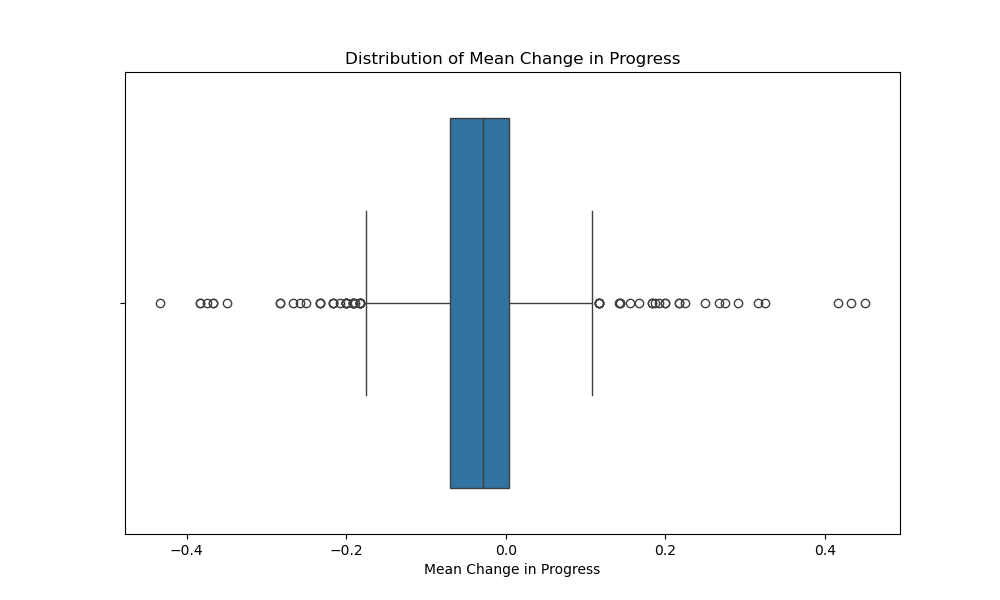

## Technical Task for Data Scientist

Question Answers
1. 1394 unique students with both sets of data
2. Overall mean progress of students between first and second test: -0.03347 (-3.347%)
3. 
4. Overall score was -0.050238 (-5.0238%) lower in the second test than the first. As the p-value < 0.05, there is significant evidence to reject the null hypothesis, meaning thereis a statistically significant difference between the test scores for the first test and the second.
5. To improve confidence in the results, you could perform sensitivity analysis to see how changes in assumptions/data affect the results. There may be a confounding factor that has not been taken into account.